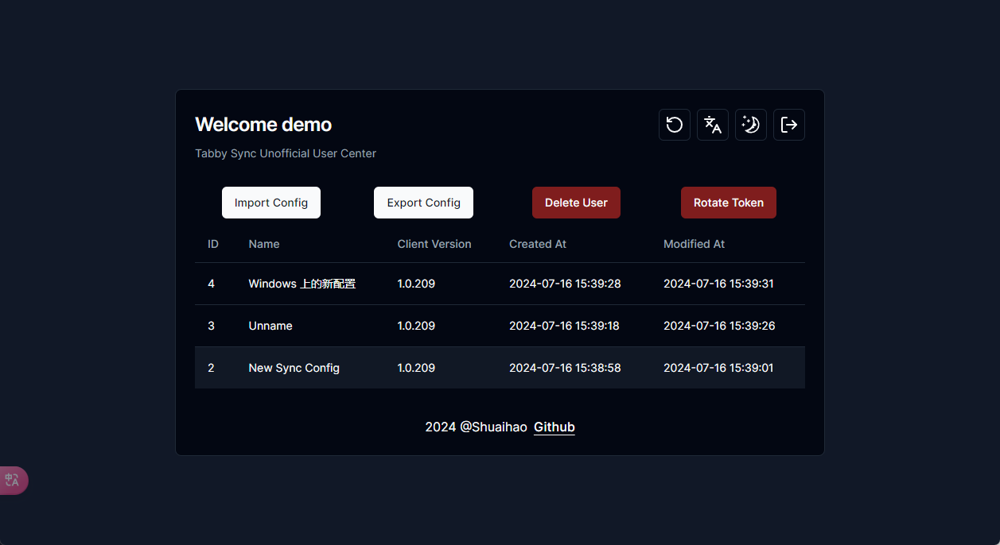
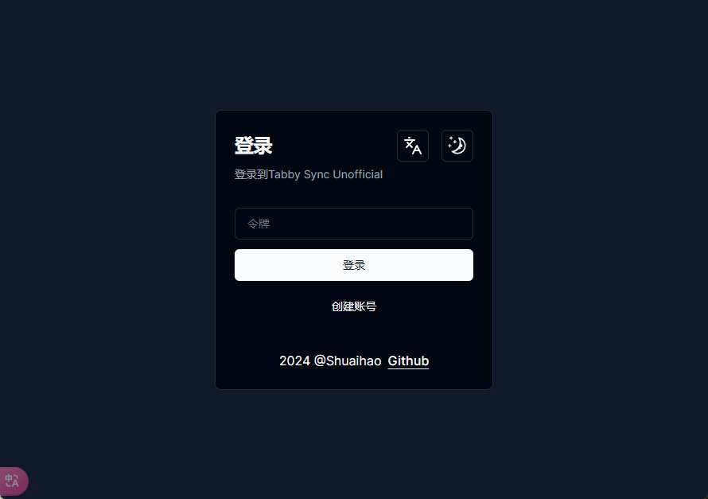
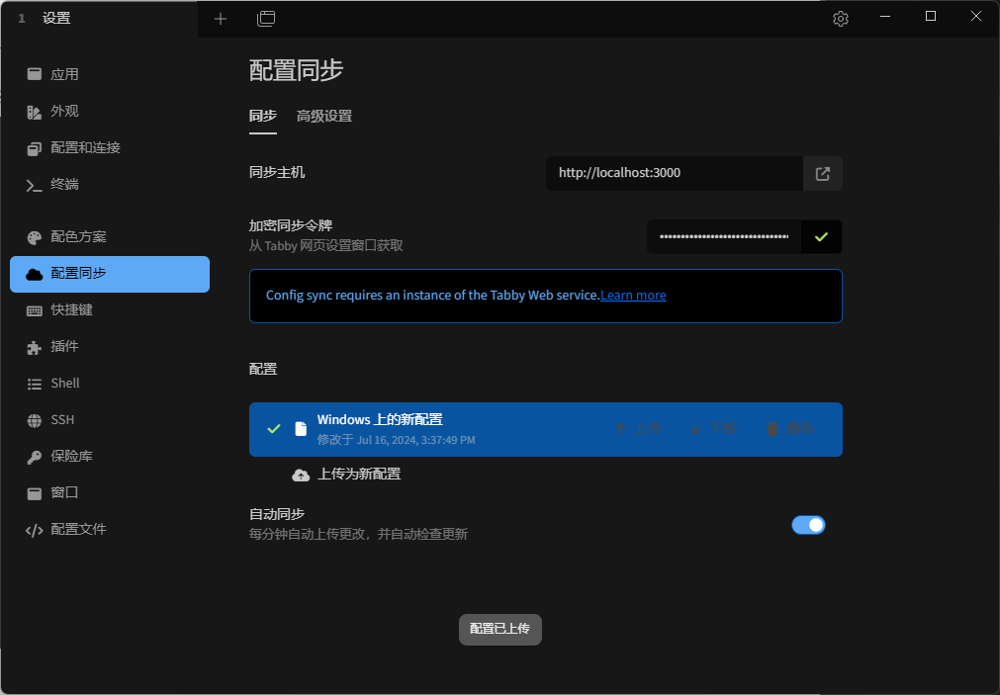

# tabby-sync-unofficial

`tabby-sync-unofficial` is a synchronization system built with Rust and Next.js, providing complete front-end and back-end synchronization capabilities for the Tabby terminal tool. This project not only includes the implementation of the back-end API, but also an interactive front-end page written in Next.js, enabling users to conveniently perform management operations.



## Features

- **High Performance**: Utilizes the efficient performance of Rust to provide fast and reliable synchronization services.
- **Easy to Use**: Implemented according to the Tabby terminal synchronization interface, no need to install any plugins, easy to integrate into existing Tabby terminal tools.
- **Modern Front-end**: Front-end page built with Next.js, providing an intuitive user interface and good user experience.
- **Secure**: Uses the AES-GCM encryption algorithm to encrypt and store synchronization data, the key is the plaintext of the token, and the database only stores the Sha512 hash value.

---

## Getting Started

> It is recommended to enable `Vault - Encrypt Configuration File` on the local Tabby client to ensure that the configuration plaintext cannot be obtained under any circumstances

- Prepare any Linux server / or use Sealos to build

- Start with Docker

    > Use SQLite database, the default database location is `/app/data.db`
    >
    > The default external port is 3000, which can be modified by yourself
    
    ```bash
    docker run -p 3000:3000 -v ./data:/app/data ghcr.io/shuaihaoV/tabby-sync-unofficial:master
    # Mainland China
    docker run -p 3000:3000 -v ./data:/app/data registry.cn-hangzhou.aliyuncs.com/shuaihao/tabby-sync-unofficial:master
    ```

- Create an account, the obtained token is the client synchronization token

  

- Client configuration

  > Just fill in the URL for the synchronization host, and press enter after filling in the encryption token

  

---

## Disable Registration

- The Rust backend checks if the environment variable `DISABLE_SIGNUP` exists, if it is the string `true`, registration is disabled

- If you need to disable the registration function after startup, please use the following command, and replace `<container_id>` with the correct id

  ```bash
  docker exec -e DISABLE_SIGNUP=true <container_id> env
  ```

---

## Development

### Backend

> Please refer to [Tabby Client Code](https://github.com/Eugeny/tabby/blob/master/tabby-settings/src/services/configSync.service.ts) for interface implementation

1. Clone the repository:
    ```bash
    git clone https://github.com/shuaihaoV/tabby-sync-unofficial.git
    cd tabby-sync-unofficial
    ```

2. Build and run the backend service:
    ```bash
    cargo build --release
    ./target/release/tabby-sync-unofficial
    ```

### Frontend

1. Enter the front-end directory:
    ```bash
    cd frontend
    ```

2. Install dependencies:
    ```bash
    npm install
    ```

3. Run the development server:
    ```bash
    npm run dev
    ```

### Encryption

- The encryption implementation code is [crypto.rs](./src/utils/crypto.rs)

  ```rust
  pub fn encrypt(key: &str, plaintext: String) -> Result<String, String> {
      let key_bytes = hex::decode(key).map_err(|_| "Invalid key")?;
      let key = Key::<Aes256Gcm>::from_slice(&key_bytes);
      let cipher = Aes256Gcm::new(key);
  
      let mut rng = rand::thread_rng();
      let mut nonce = [0u8; 12];
      rng.fill_bytes(&mut nonce);
      let nonce = Nonce::from_slice(&nonce);
  
      let ciphertext = cipher.encrypt(nonce, plaintext.as_bytes().as_ref())
          .map_err(|_| "Encryption failure")?;
  
      Ok(format!("{}.{}", hex::encode(&nonce), hex::encode(&ciphertext)))
  }
  ```

- The encryption key (i.e., the user token) is the generation key for `Aes256Gcm`, and the database stores the Sha512 hash value
- When the `get configuration` request is made, the plaintext of the user's token is used as the key to decrypt the ciphertext in the database and return it
- When the `upload configuration` request is made, the plaintext of the user's token is used as the key to encrypt the plaintext configuration entered by the user and store it in the database

---

## Contribution

Contributions are welcome! Please submit a Pull Request or report issues.

---

## Related Projects

- [tabby](https://github.com/Eugeny/tabby) : Tabby (formerly Terminus) is a highly configurable terminal emulator and SSH or serial client, supporting Windows, macOS, and Linux

---

## License

This project is licensed under the MIT License. For details, please refer to the [LICENSE](./LICENSE) file.
