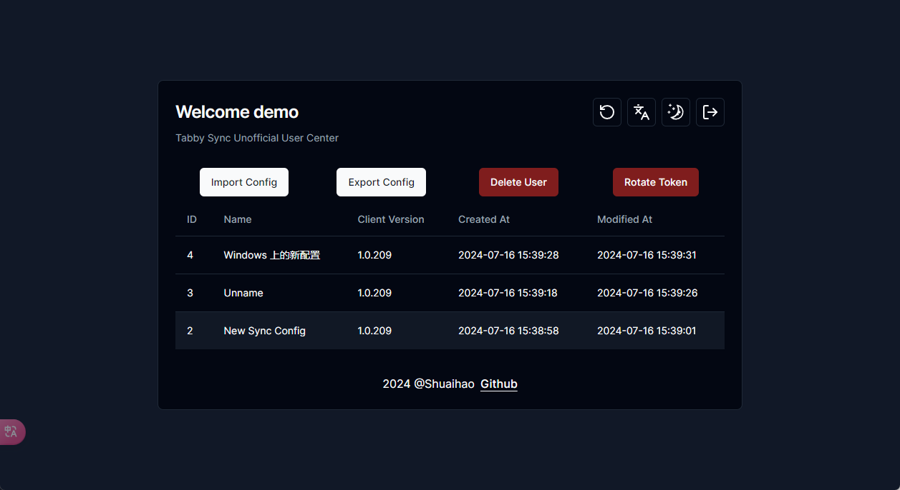
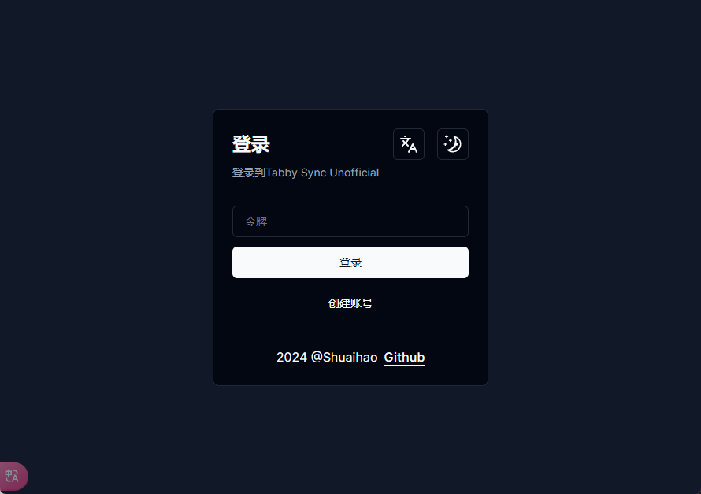
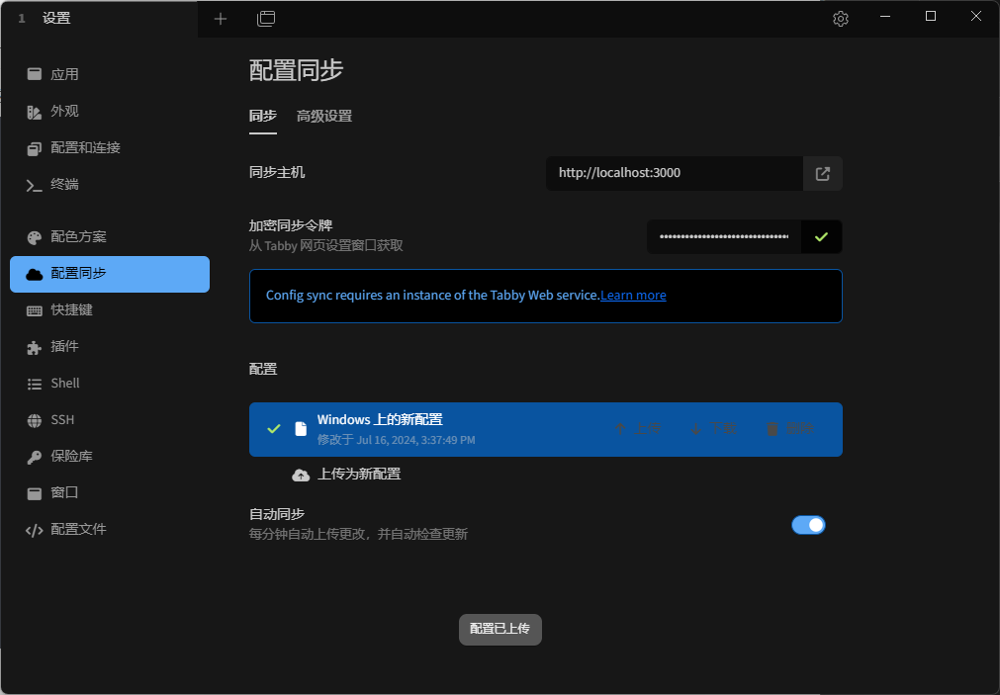

# tabby-sync-unofficial

`tabby-sync-unofficial` 是一个由 Rust 和 Next.js 构建的同步系统，它为 Tabby 终端工具提供了完整的前后端同步功能。此项目不仅包含后端 API 实现，还包含一个用 Next.js 编写的交互式前端页面，使用户能够方便地进行管理操作。



## 特性

- **高性能**：利用 Rust 的高效性能，提供快速可靠的同步服务。
- **易于使用**：根据Tabby终端同步接口实现，无需安装任何插件，方便集成到现有的 Tabby 终端工具中。
- **现代前端**：使用 Next.js 构建的前端页面，提供直观的用户界面和良好的用户体验。
- **安全**：使用AES-GCM加密算法对同步数据进行加密存储，密钥为令牌明文，数据库仅存储Sha512哈希值。

---

## 开始使用

> 建议本地Tabby客户端开启`保险库-加密配置文件`,确保在任何情况下均无法获取配置明文

- 准备好任意一台Linux服务器 / 或使用Sealos搭建

- 使用Docker启动

    > 使用SQLite数据库,数据库默认位置为`/app/data.db`
    >
    > 默认对外端口为3000,可自行修改
    
    ```bash
    docker run -p 3000:3000 -v ./data:/app/data ghcr.io/shuaihaoV/tabby-sync-unofficial:master
    # 中国大陆地区
    docker run -p 3000:3000 -v ./data:/app/data registry.cn-hangzhou.aliyuncs.com/shuaihao/tabby-sync-unofficial:master
    ```

- 创建账号,获取到的令牌即为客户端同步令牌

  

- 客户端配置

  > 同步主机填写URL即可,填入加密令牌后即可回车

  

---

## 禁用注册

- rust后端检测环境变量是否存在`DISABLE_SIGNUP`,若为字符串`true`,则禁用

- 如需在启动后禁用注册功能,请使用如下命令,并替换`<container_id>`为正确id

  ```bash
  docker exec -e DISABLE_SIGNUP=true <container_id> env
  ```

---

## 开发

### 后端

> 请参照 [Tabby 客户端代码](https://github.com/Eugeny/tabby/blob/master/tabby-settings/src/services/configSync.service.ts) 进行接口实现

1. 克隆仓库：
    ```bash
    git clone https://github.com/shuaihaoV/tabby-sync-unofficial.git
    cd tabby-sync-unofficial
    ```

2. 构建并运行后端服务：
    ```bash
    cargo build --release
    ./target/release/tabby-sync-unofficial
    ```

### 前端

1. 进入前端目录：
    ```bash
    cd frontend
    ```

2. 安装依赖：
    ```bash
    npm install
    ```

3. 运行开发服务器：
    ```bash
    npm run dev
    ```

### 加密

- 加密实现代码为 [crypto.rs](./src/utils/crypto.rs)

  ```rust
  pub fn encrypt(key: &str, plaintext: String) -> Result<String, String> {
      let key_bytes = hex::decode(key).map_err(|_| "Invalid key")?;
      let key = Key::<Aes256Gcm>::from_slice(&key_bytes);
      let cipher = Aes256Gcm::new(key);
  
      let mut rng = rand::thread_rng();
      let mut nonce = [0u8; 12];
      rng.fill_bytes(&mut nonce);
      let nonce = Nonce::from_slice(&nonce);
  
      let ciphertext = cipher.encrypt(nonce, plaintext.as_bytes().as_ref())
          .map_err(|_| "Encryption failure")?;
  
      Ok(format!("{}.{}", hex::encode(&nonce), hex::encode(&ciphertext)))
  }
  ```

- 加密密钥(即用户令牌)  为 `Aes256Gcm`的生成密钥,数据库存储Sha512哈希值
- `获取配置`请求时,使用用户传入的令牌明文作为密钥,解密数据库中密文并返回
- `上传配置`请求时,使用用户传入的令牌明文作为密钥,加密用户传入的明文配置,存储在数据库中

---

## 贡献

欢迎贡献代码！请提交 Pull Request 或报告问题。

---

## 相关项目

- [tabby](https://github.com/Eugeny/tabby) : Tabby (前身是 Terminus) 是一个可高度配置的终端模拟器和 SSH 或串口客户端，支持 Windows，macOS 和 Linux

---

## 许可证

本项目采用 MIT 许可证。详情请参阅 [LICENSE](./LICENSE) 文件。
